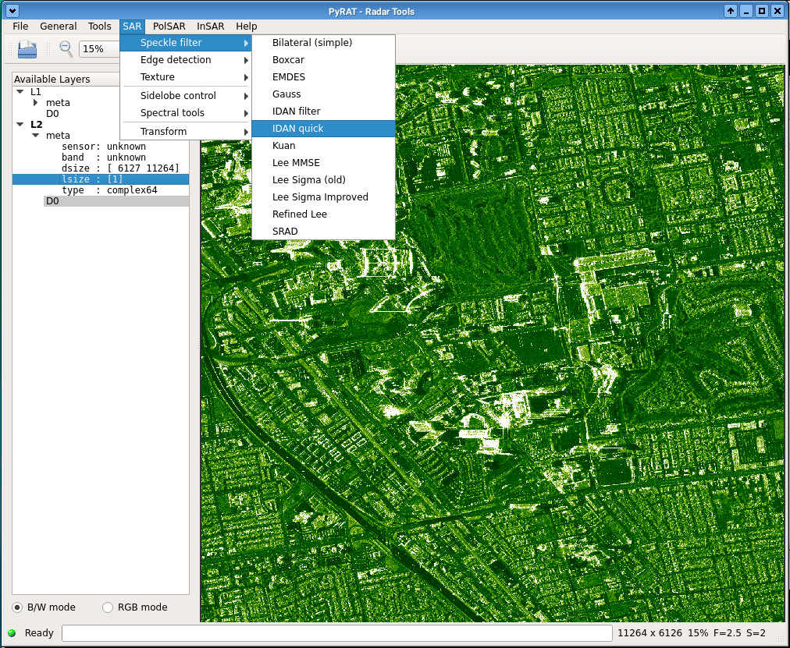
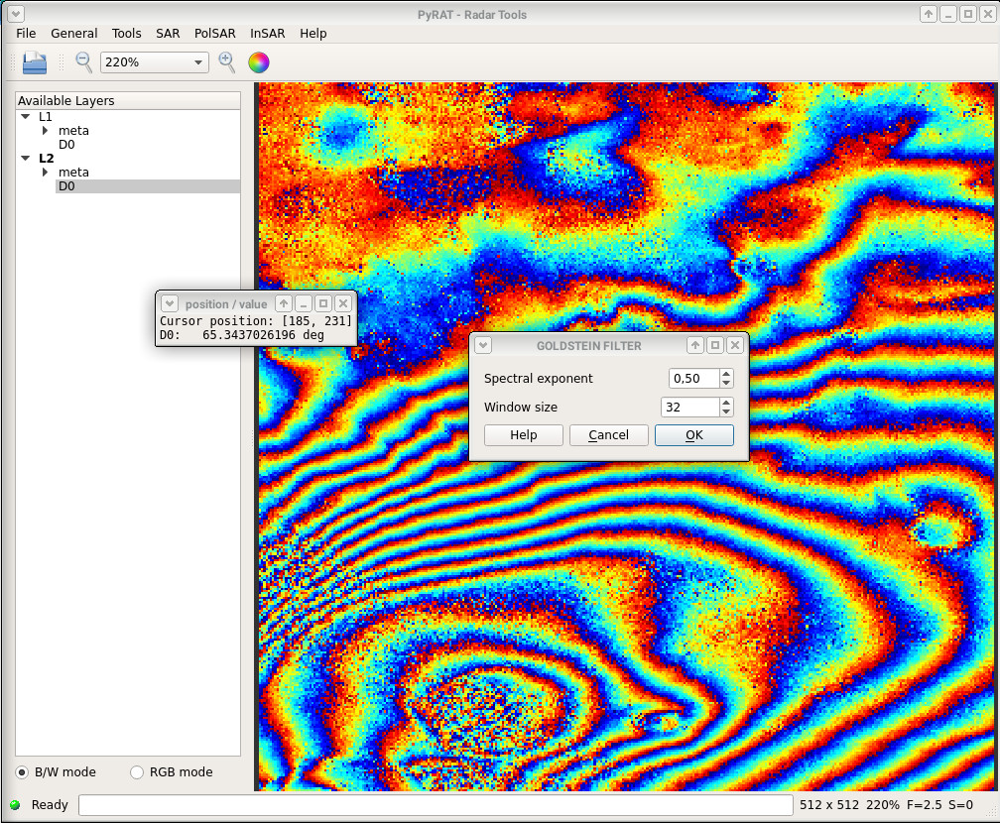
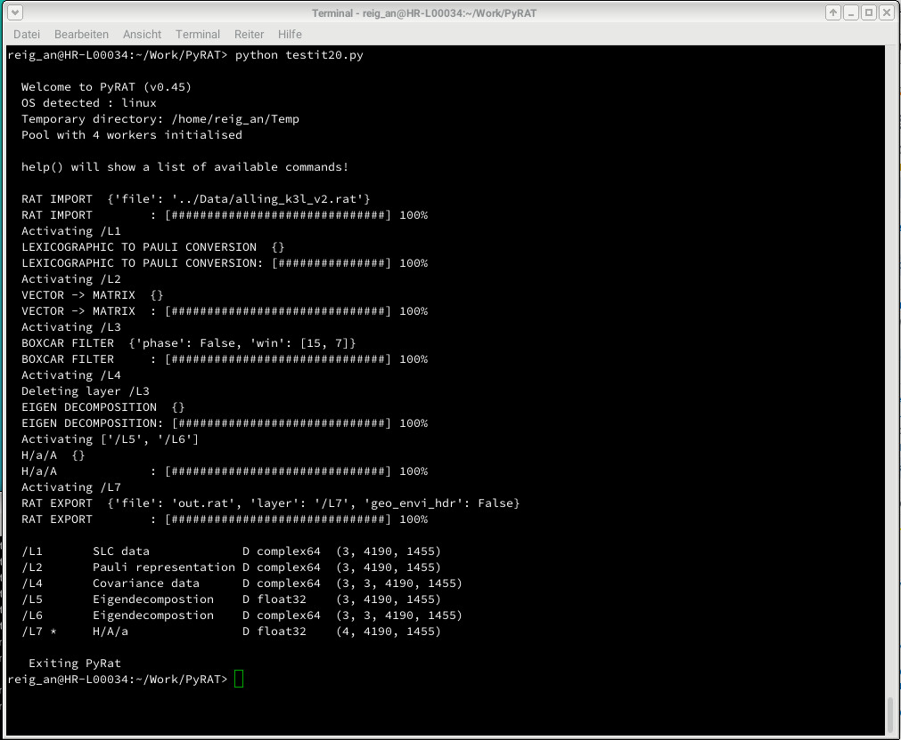

# PyRAT (Python Radar Analysis Tools)

PyRat is a flexible framework for postprocessing synthetic aperture radar (SAR) data. It
is made for both airborne and spaceborne data and especially focused on providing an
easy plugin-based programming interface. 

Technically, PyRat is implemented in Python (supported by some Cython) and uses HDF5 based 
disc containers for temporary storage. It features automatic multithreaded block 
processing for speed and memory efficiency, a powerful batch system and a Qt-based GUI. 
It is expandable by plugins without deep knowledge of framework itself.

## Screenshots

## Download

    git clone https://github.com/birgander2/PyRAT

## Requirements

Pyrat is developed in Python 3. It does _not_ run under Python 2. Required python packages are specified in the
file _requirements.txt_. We recommend using the free [Anaconda Python
distribution](https://docs.continuum.io/anaconda). There are 3 ways to get a nice python environment for running PyRAT:

* **Dedicated Miniconda environment (recommended, Linux only!)**

Miniconda is a minimal Anaconda installation. It is not directly sufficient to run PyRAT, but can easily be extended
with all required modules. This avoids potential conflicts between the installed packages, as it might happen with
the other 2 solutions. These steps are needed:

    wget -q https://repo.continuum.io/miniconda/Miniconda3-latest-Linux-x86_64.sh    # Download Miniconda
    bash Miniconda3-latest-Linux-x86_64.sh -b -p /my/path/Python_PyRAT               # Install it (adapt path!)
    source activate /my/path/Python_PyRAT                                            # Activate it
    conda env update -n base -f requirements.txt                                     # Add all required packages

Now you Miniconda installation is ready to be used. To later reactivate it (for example in another terminal,
you have to repeat once the 'export' command (again, adapt path to correct place):

    source activate /my/path/Python_PyRAT

* **Dedicated Anaconda environment**

With Anaconda, you can create and activate a pyrat-compatible virtual environment with the commands  (pyrat in the box below is
the user-chosen name for the virtual environment, you can freely change it):

    conda env create -f requirements.txt -n pyrat
    source activate pyrat   [on Linux]
    activate pyrat          [on Windows]

* **Update of the base Anaconda distribution**

Alternatively, one can also directly install all the required packages with the command (depending on your anaconda version
replace 'base' by 'root'):

    conda env update -n base -f requirements.txt

Basically all development is done on Linux systems. As a pure python / cython project, pyrat should run also on
Windows and OSX, but this is genuinely untested - feedback appreciated!

**Sometimes there are some small differences between the requirements on different platforms. Currently, on Windows,
please use the requirements_win.txt file instead.**

## Installation

**You can run PyRAT directly from its source / download directory without further installation.** Most functionality will be 
there without compiling. However, compiling will add accelerated versions of some modules (by using cython) and 
some additional fuctionality. We did not succeed yet to compile correctly on Windows (help needed!). If pyrat keeps
on crashing at startup on Windows after compiling, please move back to a pure source version.

**Compile / build:** This is only needed if you want to benefit from some fast cython and C modules. 
    
    python setup.py build_ext --inplace

**Install (with root rights):** This is only needed if you want to install pyrat in the system's python site-packages. This command will also
compile the cython and C modules.

    python setup.py install

**Install (as user):** This is only needed if you want to install pyrat in the users's python site-packages. This command will also
compile the cython and C modules.

    python setup.py install --user

**Configuration:** At startup, pyrat searches for a file _$HOME/.pyratrc_ (pyrat.ini on Windows)
and generates a new one if not there.
It should contain the name of a directory used for storing temporary files. As default _/tmp_ (something else
on Windows) is used, which is often not a good choice. Choose a tempdir on a large, fast, local harddrive and
check it from time to time for lost tempfiles.

The value for 'NThreads' influences the number of parallel jobs used. Set this to your number of CPU cores. The
autodetection might be too high if your CPU suppors hyperthreading. In such a case, set the correct (lower) number.
Note that too many threads are causing only overhead and will slow down processing.

## Documentation

The folder _doc_ contains a powerpoint file, explaing the basic usage of pyrat (it might happen
that it is a bit outdated...). Apart from that, the pyrat CLI interface contains an internal help system:
    
    >>> help()      		        [Liste of available commands and modules]       
    >>> help(function)              [Help for a particular function]       
    >>> help(modul.function)    	[Help for a particular function out of a modul]       

The content of the internal help system is based on the docstrings in the source code. Their
quality might vary ;-)

Additionally, some documentation can be found on the
[project's wiki page](https://github.com/birgander2/PyRAT/wiki) on GitHub. 

If you need further assistance, please contact the authors or open an issue on GitHub.

## Usage

CLI Interface:

    ./pyrat.run -b [rat filename]
    ./pyrat.run --batch [rat filename]

    In case of problems, use the --debug flag to get more debugging output. This is also useful when
    implementing own modules, as it disables multiprocessing which simplifies debugging.

    
GUI Interface:

    ./pyrat.run [rat filename]

Current modules:
* load:      Importing of data
* save:      Exporting of data
* filter:    Various image manipulations
* transform: Geometrical transformations
* insar:     Interferometric processing
* polar:     Polarimetric processing

More information about modules and contents (replace 'module' by correct name, e.g. 'filter):
    
    >>> help(module)

## Example batch usage

    ./pyrat.py -b
    >>> x1 = load.rat('abc.rat')
    >>> x2 = filter.lee(looks=3)
    >>> x3 = filter.boxcar(layer=x1)
    >>> save.pixmap('abc.jpg', layer=x2)
    >>> var = getdata(layer=x1)
    >>> show()

## Important comment on using PyRAT

PyRAT expects a bit that you know what you're doing. In particular, it might be required to perform certain
operations before doing others; PyRAT will not necessarily check or care if input data for certain modules
are the ones needed. In some cases, an entire chain of steps are required to get the desired results.

Some examples: Multi-looking before decompositions, conversion into covariances prior to speckle filtering,
conversion into covariances, multi-looking, eigendecomposition before calculating entropy / alpha. There are
many more examples like that, so please remember that PyRAT offers 'only' a collection of singular tools, not
(yet) entire tool-chains. This is planned, though.

## Implementing your own modules

PyRat has a very simple programming interface. Have a look at the file 'pyrat/filter/Template.py',
this should explain at least the basics of programming own modules. Put your own code
in the 'plugins' directory, it is automatically scanned at startup. PyRat will automatically
attach your code to the GUI and run it using parallel processing.

For more detailed questions, please contact us directly (anderl@nought.de)

## Getting involved

PyRAT is an open project - we happily welcome external contributions. So if you are interested in joining the team
or if you have own modules you would like to see in the official PyRAT distribution,  please get in touch with 
us (Email: anderl@nought.de). If needed, we can provide you with more information on how to contribute and how to program PyRAT.

In particular, we are currently looking for help in the following areas:
* Processing modules of any kind (of course)
* GUI programming (we are not good in this)
* Windows integration / testing / packaging 
* Better documentation
